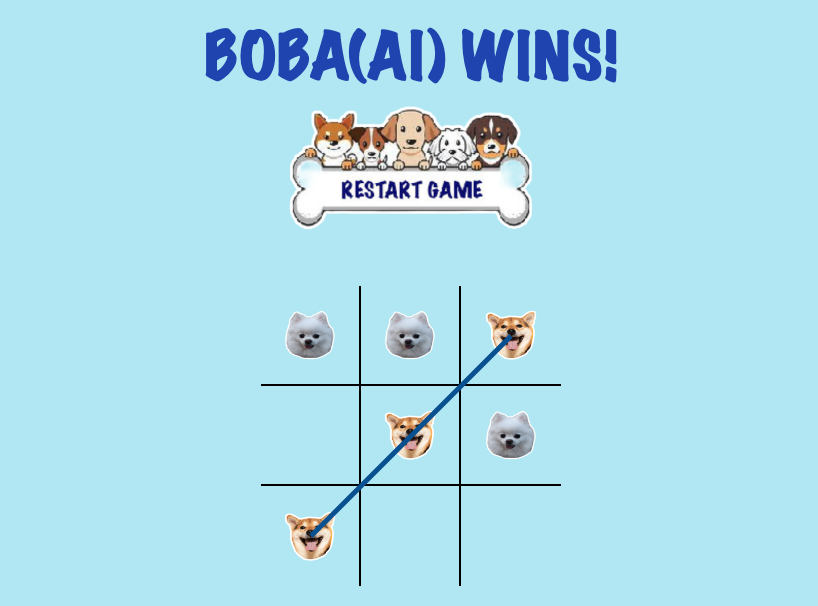

# TIC TAC TOE

### Welcome to my game Tic Tac Toe!

Click ⬇ to START!  

## Project Summary:
Created a Tic Tac Toe game using JavaScript, showcasing proficiency in front-end web development and problem-solving skills. The game allows you to play against an AI to take turns marking X and O on a 3x3 grid until one player wins or the game ends in a draw. Implemented logic to validate moves, check for win conditions, and handle game outcomes. Demonstrated understanding of HTML, CSS, and JavaScript to build an interactive and user-friendly gaming experience. Utilized object-oriented programming principles to structure the code and maintain modularity.

## Key Features:
* **JavaScript Mastery:** The project showcases my expertise in JavaScript, employing modern ES6+ features and understanding behind-the-scenes concepts like the event loop, hoisting, and scoping. &nbsp; 
  
* **Game Logic:** I have implemented the complete game logic, allowing players to interact with the command-line interface and enjoy seamless gameplay against the AI.  
* **AI using Minimax Algorithm:** The AI player is powered by the powerful Minimax algorithm, ensuring challenging gameplay and intelligent moves by the AI opponent.  
* **User Interaction:** The command-line interface provides an intuitive experience for players to make their moves and witness the AI's moves in real-time.  
* **Winning Detection and Visualization:** The project includes a winning combination detection algorithm that accurately identifies the winner and visually highlights the winning line on the board using SVG.  
* **Modularity and Organization:** I have designed the codebase with a focus on modularity and organization, promoting code readability and maintainability.  
* **Error Handling and Game State Management:** Robust error handling ensures smooth gameplay, while proper game state management allows for game restarts and tracking the state of the board.  
* **Version Control:** The project is hosted on GitHub, reflecting my proficiency in version control and collaborative development practices.  

## How to use

1. Click on the icon at the top to play the game.

2. You will be playing against an AI.

## Built With

Javascript, Html, SCC, Python(Game in terminal only for python)

## Authors

**Ryan Kim** - [Ryankrdh](https://github.com/ryankrdh)

## License

This project is licensed under the MIT License. Feel free to use and modify it according to your needs.
